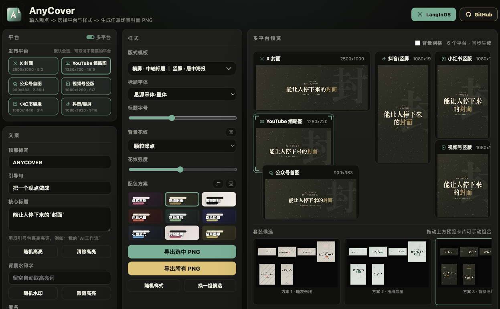

# AnyCover

Create a complete cover suite from one idea.

AnyCover is a browser-based multi-platform cover generator for creators, builders, and writers who need polished visual assets without opening a design tool. Write one headline, tune the visual system once, and export platform-ready PNG covers for X, YouTube, WeChat, Douyin, Xiaohongshu, and more.



## Why It Exists

Most cover tools optimize for a single canvas. AnyCover is designed for distribution: one message, multiple formats, consistent visual language, real export sizes.

It helps turn a concise idea into a coordinated publishing kit that can travel across social platforms without manually rebuilding the same design again and again.

## Features

- Multi-platform generation from one copy set
- True-size PNG export for every selected platform
- Horizontal and vertical layout templates with independent control
- Multi-platform preview wall with draggable and resizable cards
- Cover candidates for quickly exploring palettes, patterns, and compositions
- Highlight syntax with backticks, for example ``build a `better workflow` ``
- Title font, size, palette, pattern, watermark, and signature controls
- Static frontend only: no backend, account, or upload required

## Supported Formats

- X cover: 2500x1000
- YouTube thumbnail: 1280x720
- WeChat article cover: 900x383
- WeChat Channels vertical cover: 1080x1260
- Xiaohongshu vertical cover: 1080x1440
- Douyin vertical cover: 1080x1920

## Usage

Open the app, write your copy, choose the platforms you want, tune the style, then export.

The fastest workflow:

1. Enter a label, lead line, headline, and signature.
2. Wrap important words in backticks to highlight them.
3. Keep multi-platform mode on to generate a full publishing suite.
4. Adjust templates, title font, color palette, and background pattern.
5. Export the selected cover or export all platform PNGs.

## Run Locally

AnyCover is a static app. You can serve the repository with any local static server.

```bash
python3 -m http.server 4173
```

Then open:

```text
http://localhost:4173/
```

You can also deploy the files directly to any static hosting provider.

## Project Structure

```text
index.html
styles.css
app.js
assets/
```

## Design Direction

AnyCover uses a restrained dark workspace, quiet controls, and editorial cover compositions. The product is intentionally practical: fast enough for daily publishing, flexible enough for platform-specific output, and distinctive enough to make the multi-platform suite itself the core creative artifact.

## License

This project is open for exploration and iteration. Add a license before using it in a public commercial distribution.
